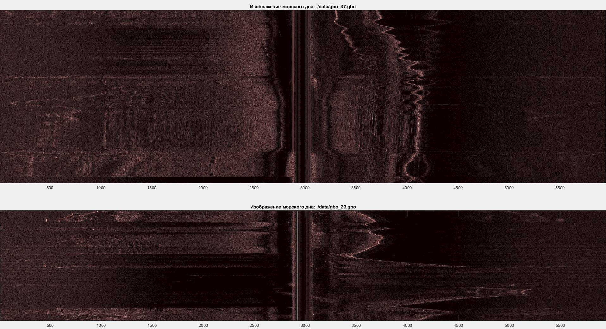
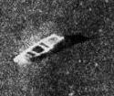
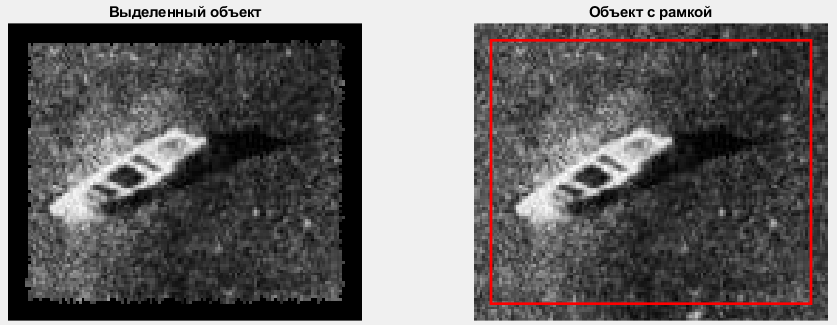
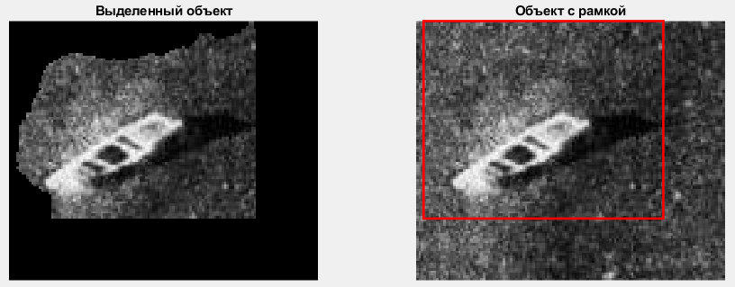
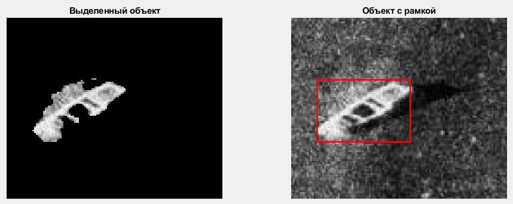
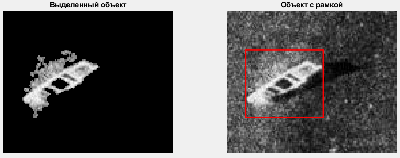
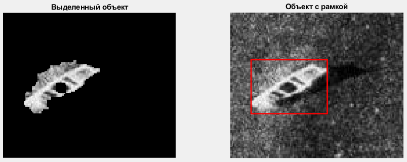
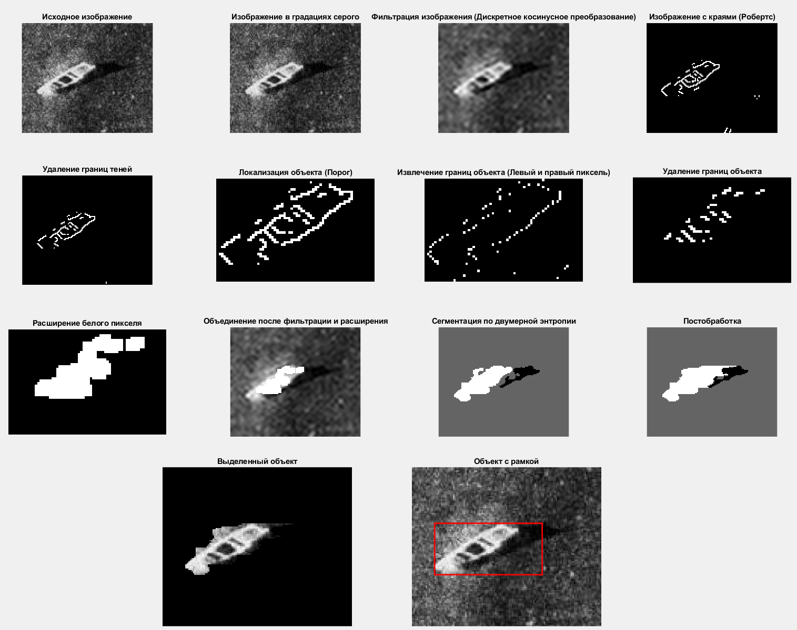
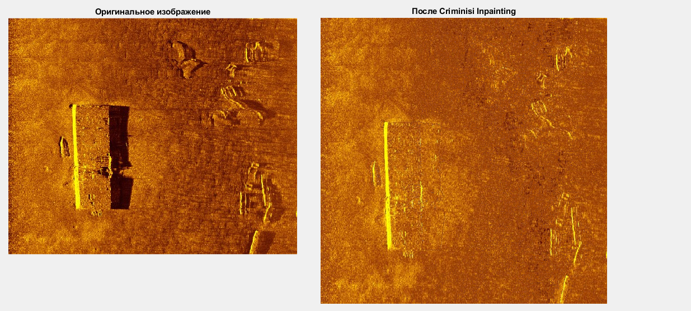
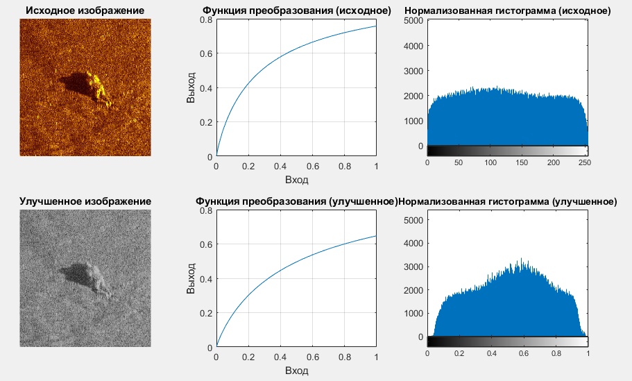

# Визуализация морского дна и алгоритмы сегментации

## Описание проекта
Данный проект направлен на визуализацию данных с карт морского дна, полученных с гидролокатора бокового обзора, а также анализ и сегментацию изображений. Основное внимание уделяется разработке алгоритмов для обработки и выделения объектов с изображений.

---

## Основные компоненты проекта

### Визуализация исходных данных
Скрипт `main.m` предоставляет возможность загрузки и визуализации карт морского дна. Исходные данные представлены в формате `.gbo` и `.idx`.

- **Визуализация**: Функция читает и преобразует данные в изображение, отображая его с использованием цветовой схемы `pink`.
  
  **Результат работы:**
  

---

## Алгоритмы сегментации

### Исходное изображение для сегментации
Пример исходного изображения, с которого сегментируется объект:

  

---

### Метод активных контуров (Chan-Vese)
Метод сегментации с использованием активных контуров. Скрипт `chan_vese_method.m` включает:
1. Преобразование изображения в градации серого.
2. Расчет текстурных признаков (например, контраст, энергия, однородность).
3. Построение контуров на основе признаков.

**Результат:**

### Метод текстурных признаков Харелика
Этот алгоритм использует локальные текстурные характеристики для точной сегментации. Скрипт `haralick_textural_features.m`

**Результат:**

### K-means кластеризация
Этот метод `k_means.m` сегментирует изображение на основе разбиения на несколько кластеров, соответствующих разным областям изображения (объект, фон, тень).

**Результат:**

### Совмещение K-means и метода Чана-Везе
Комбинация грубой кластеризации методом K-means и точной сегментации активных контуров `k_means_chan_vese.m`.

**Результат:**

### Сегментация оператором Собеля и K-means
Метод включает подчеркивание контуров оператором Собеля, с последующей кластеризацией `k_means_sobel_edge.m`.

**Результат:**

### Метод энтропийной сегментации
Сегментация на основе расчета двумерной энтропии, использующая как локальные, так и глобальные текстурные признаки изображения. Скрипт `main.m` в папке `entropy method`.

**Результат:**

### Удаление теней с помощью Criminisi Inpainting
Этот метод применяется для удаления теней из изображения, что упрощает последующую сегментацию, например, методом K-means. Скрипт `criminisi_inpainting`.

- Используются алгоритмы устранения теневых участков с дальнейшим заполнением областей с помощью Criminisi Inpainting.

**Результат:**

### Повышение резкости методом Лапласа
Метод Лапласа применяется для улучшения контрастности и повышения резкости изображения, что помогает выделить важные детали. Скрипт `image_processing_by_Laplace_method.m`.

**Результат:**

---

## Вывод
Результаты сегментации зависят от качества исходных данных. Наибольшую точность можно достичь при соблюдении следующих условий:
- Нормализация изображений (например, гистограммное выравнивание).
- Единое разрешение для всех изображений.
- Устранение шума с помощью предварительной фильтрации.
- Удаление ненужных элементов, таких как тени и блики с использованием дополнительных методов, таких как Criminisi Inpainting.

Алгоритмы могут демонстрировать различное поведение в зависимости от характера данных, таких как уровень контрастности, наличие шумов или артефактов на изображении.

**Основное ограничение:** Разработка универсального алгоритма для сегментации изображений морского дна может быть затруднена из-за неоднородности данных. Оптимизация параметров под конкретные задачи способна улучшить результативность.

